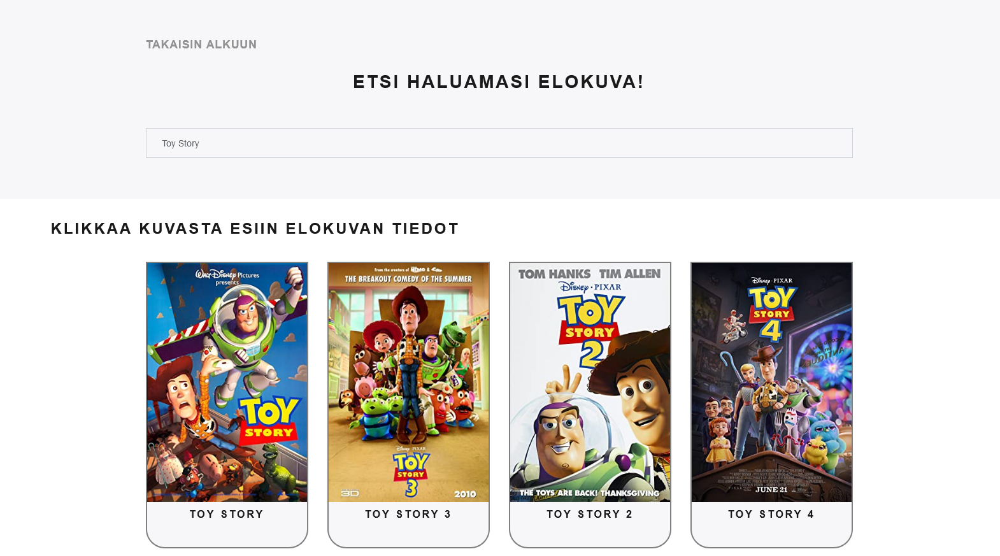
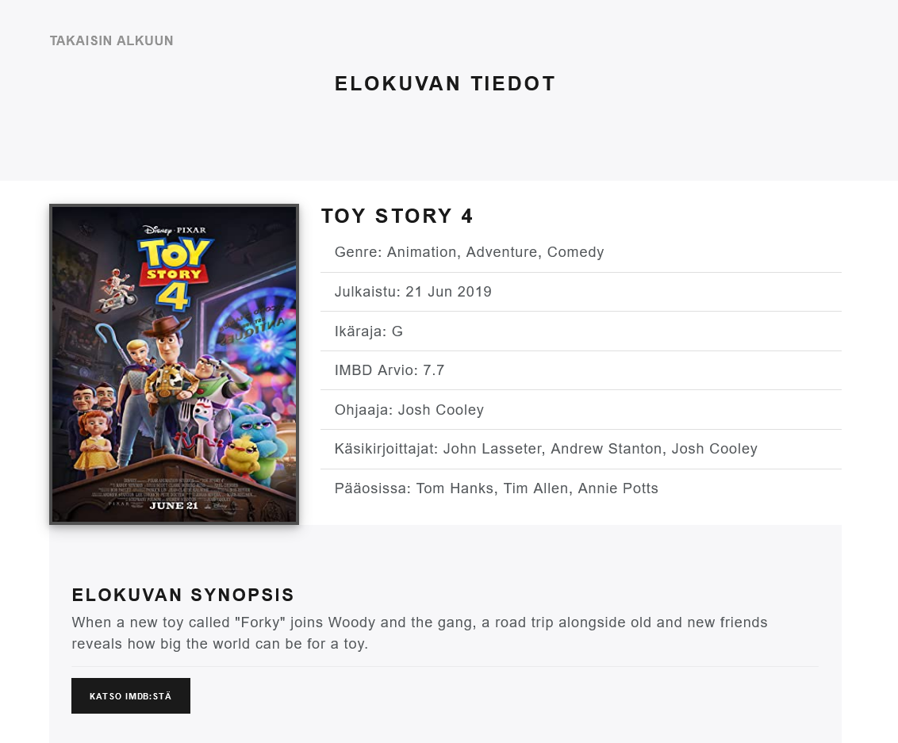

# Esimerkki JavaScript Projektista (jQuery)

Tämä on vain esimerkki jQuery-sovelluksesta käyttäen Elokuva OMDB API kirjastoa.
Etsi Haluamasi Elokuva - sovellus on itsenäisesti tehty projekti käyttäen esimerkkejä ja opetusmateriaaleja. 

## Linkki sovellukseen

- __[netlify-sovellus](https://js3daniel.netlify.app/)__ - testaa sovelluksen toimintaa